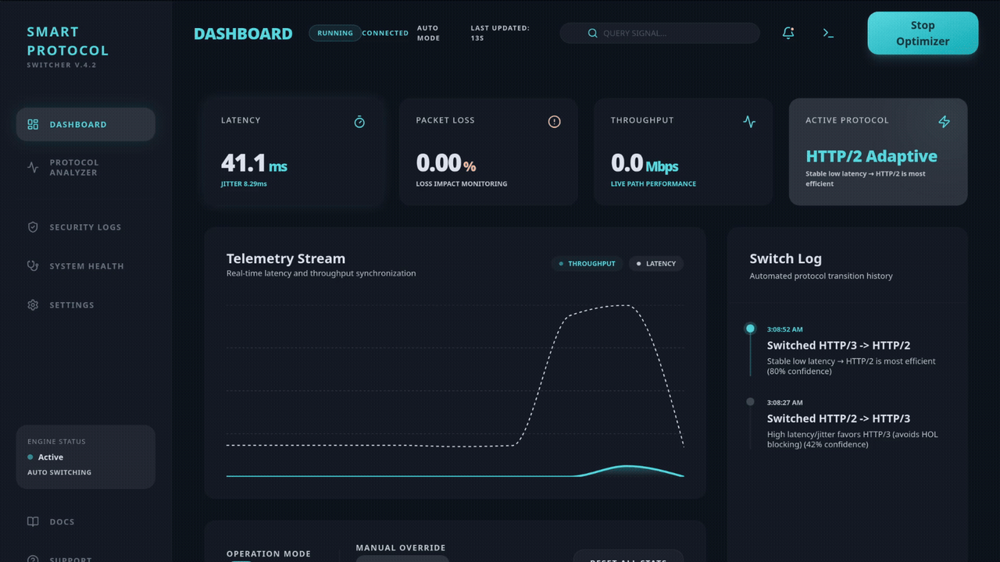
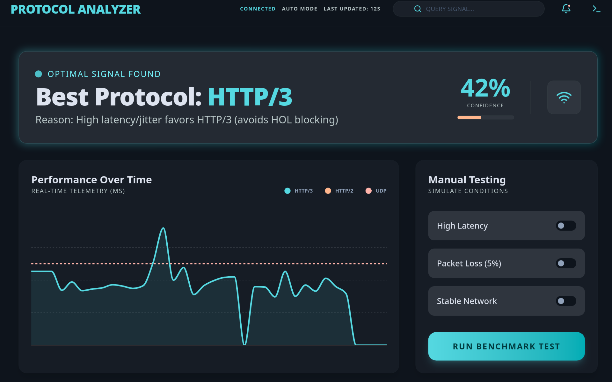
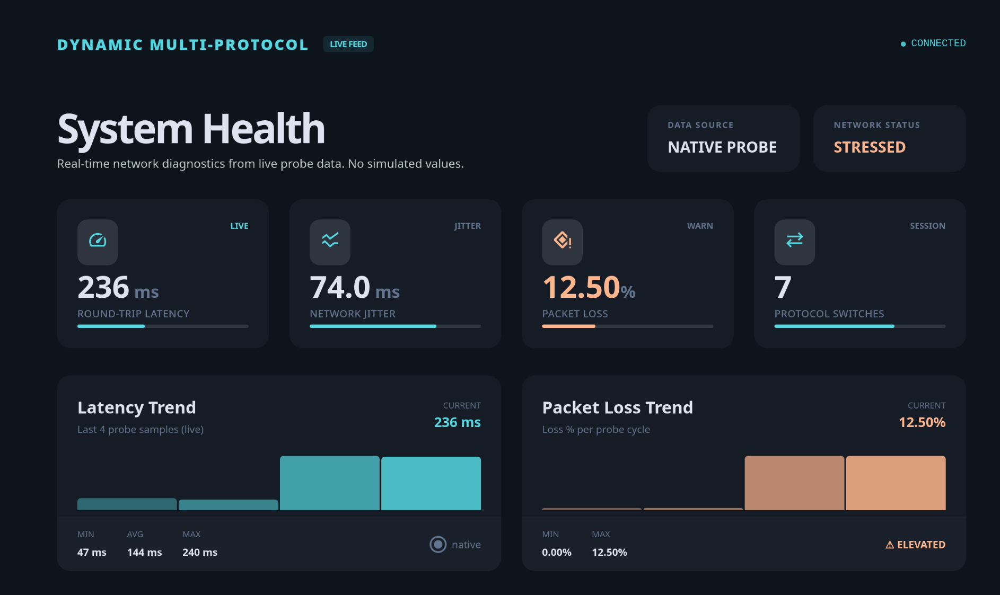
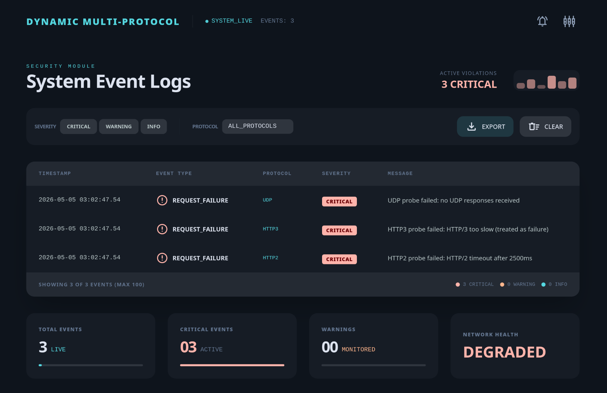

# ProtoFlow

🚀 Multi-protocol traffic intelligence for modern desktop workflows.


## 🔍 Preview

### 🎬 Workflow Demo

<!-- dashboard.gif: animated walkthrough of dashboard interactions and workflow -->



<p><em>End-to-end interaction flow from monitoring to smart route switching.</em></p>

---

### 🔬 Protocol Analyzer

<!-- ProtocolAnalyzer.png: analyzer view comparing protocol behavior and routing intelligence -->



<p><em>Deep protocol comparison across performance and reliability dimensions.</em></p>

---

### 🧠 System Health Dashboard

<!-- SystemHealth.png: main dashboard with protocol status, health cards, and core metrics -->



<p><em>Live system status, traffic KPIs, and optimization signals.</em></p>

---

### 🛡️ Event Logs

<!-- EventLogs.png: security and operational event logs for observability -->



<p><em>Operational and security events for transparent observability.</em></p>

## ✨ Features

- Intelligent protocol routing across HTTP/2, HTTP/3, and UDP.
- Live network telemetry with latency, jitter, packet loss, and throughput insights.
- Desktop-first monitoring dashboard built for rapid decision-making.
- Real-time event stream with security log tracking and protocol scoring.
- Configurable switching policies with manual override for controlled experiments.
- Modular architecture ready for contributors and production hardening.

## ⚙️ Installation

### 1. Clone the Repository

```bash
git clone https://github.com/CN-2026-IIITA/ProtoFlow.git
cd ProtoFlow
```

### 2. Install Root Dependencies

```bash
npm install
```

### 3. Install Backend Dependencies

```bash
cd backend
npm install
cd ..
```

### 4. Verify Prerequisites

- Node.js 18+
- Rust and Cargo
- C++ toolchain (build-essential, cmake, clang)

## ▶️ Usage

### Run Web Development Mode

```bash
npm run dev
```

### Run Desktop Development Mode (Tauri)

```bash
npm run tauri:dev
```

### Build Production Artifacts

```bash
npm run build
npm run tauri:build
```

## 🧰 Tech Stack

- Frontend: React, Vite, TypeScript, Tailwind CSS
- Desktop Runtime: Tauri
- Backend: Node.js, TypeScript, Express, WebSocket
- Native Performance Layer: C++ addon via node-gyp
- Systems Layer: Rust (Tauri core)

## 🗂️ Project Structure

```text
ProtoFlow/
├── assets/
├── backend/
│   ├── native/
│   ├── src/
│   │   └── router/
│   └── test/
├── public/
├── src/
│   ├── components/
│   ├── data/
│   ├── hooks/
│   ├── pages/
│   └── store/
├── src-tauri/
│   ├── capabilities/
│   ├── gen/
│   ├── icons/
│   └── src/
├── index.html
├── package.json
├── README.md
└── vite.config.ts
```

## 🤝 Contributing

We welcome contributions from students, maintainers, and open-source collaborators.

### How to Contribute

1. Fork the repository.
2. Create a feature branch.
3. Commit clear, focused changes.
4. Push your branch and open a Pull Request.
5. Include relevant screenshots or logs when UI or behavior changes.

### Suggested Workflow

```bash
git checkout -b feature/your-feature-name
npm run dev
git add .
git commit -m "feat: add your feature"
git push origin feature/your-feature-name
```

## 📄 License

Distributed under the MIT License.

See LICENSE for details.
